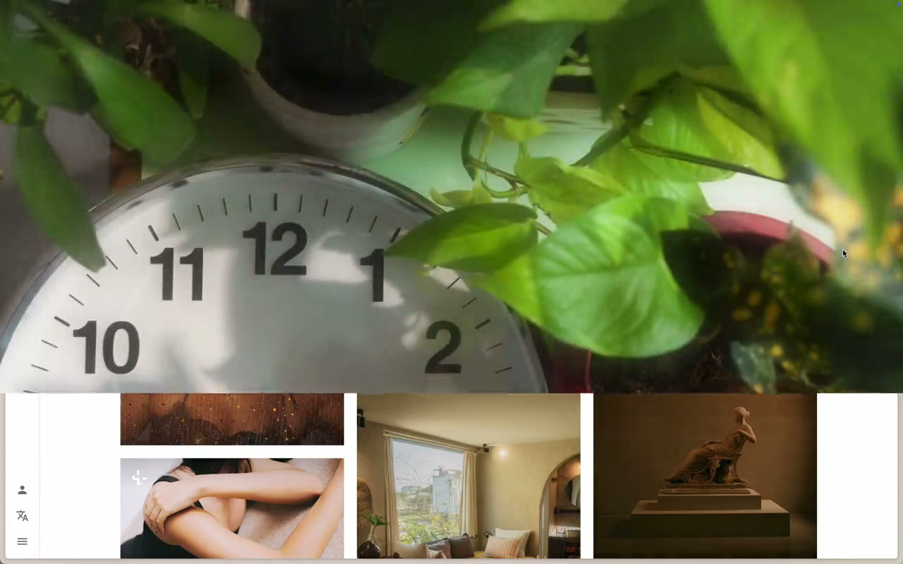

# Shady
iOS like pull down notification shade for your mac. Swipe down from the top edge with two fingers. Does not show notifications. Just the clock.

[](docs/demo.mp4)

*[Watch the demo](docs/demo.mp4), you already know what it is*

## First run

macOS blocks it because it is not notarized. After moving it to Applications:

```sh
xattr -dr com.apple.quarantine /Applications/Shady.app
```

Allow Accessibility permission so it doesn't scroll the content behind it when swiping down.