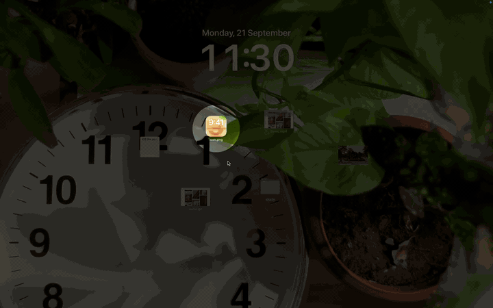

# Shady
### iOS like pull down notification shade for your mac.
Swipe down from the top edge with two fingers. Does not show notifications. Shady is your drawer to put things in. Click an item to copy it back to clipboard.



*You already know what it is. [Watch the demo](docs/drawer.mp4).*

## Download

[Download Shady.dmg](https://github.com/akshar-dave/shady-macos/releases/download/v1.1/Shady-1.1.dmg)

## First run

macOS blocks it because it is not notarized. After moving it to Applications:

```sh
xattr -dr com.apple.quarantine /Applications/Shady.app
```

Allow Accessibility permission so it doesn't scroll the content behind it when swiping down.
