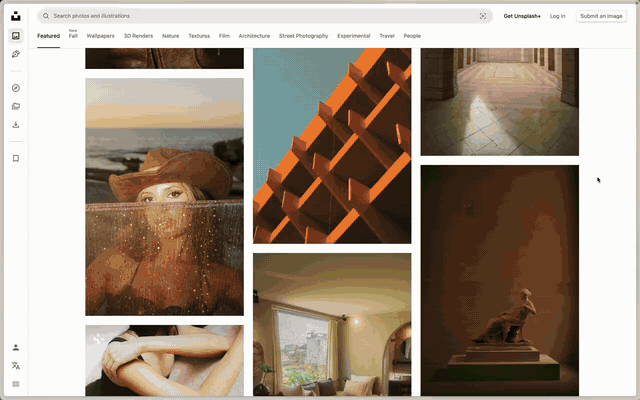

# Shady
# iOS like pull down notification shade for your mac.
Swipe down from the top edge with two fingers. Does not show notifications. Just the clock.



*You already know what it is. [Full quality video](docs/demo.mp4).*

## Download

[Download Shady.dmg](https://github.com/akshar-dave/shady-macos/releases/download/release/Shady-1.0.dmg)

## First run

macOS blocks it because it is not notarized. After moving it to Applications:

```sh
xattr -dr com.apple.quarantine /Applications/Shady.app
```

Allow Accessibility permission so it doesn't scroll the content behind it when swiping down.
